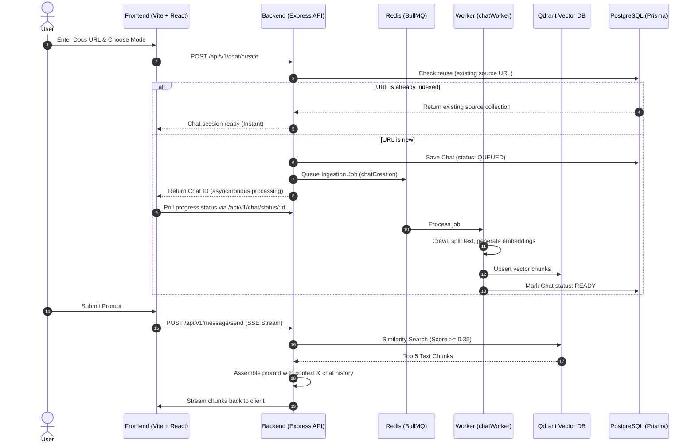

# DocChat - Chat with Docs (RAG Application)

Chat with any documentation using AI. Provide a documentation link, and the system will scrape, process, and convert it into a searchable knowledge base that you can interact with through natural language.

Check out the live website here: [DocChat](https://avishek.short.gy/docchat)

---

## 📚 Developer Guide Directory

For detailed documentation, please refer to the files in the `docs/` folder:

| Guide | Description |
| :--- | :--- |
| 🏗️ [Architecture Guide](https://github.com/avishek0769/DocChat/blob/main/docs/architecture.md) | In-depth pipeline sequences, database details, and Mermaid workflows. |
| ⚙️ [Backend Guide](https://github.com/avishek0769/DocChat/blob/main/docs/backend-guide.md) | Folder layout, database schemas, BullMQ queuing, and encryption details. |
| 🎨 [Frontend Guide](https://github.com/avishek0769/DocChat/blob/main/docs/frontend-guide.md) | Vite/Tailwind v4 layouts, routing, caching layers, and styling principles. |
| 🔌 [API Reference](https://github.com/avishek0769/DocChat/blob/main/docs/api-guide.md) | Complete endpoints map, parameters, JSON shapes, and auth requirements. |
| 🛠️ [Setup & Troubleshooting](https://github.com/avishek0769/DocChat/blob/main/docs/troubleshooting.md) | Detailed listing of 25+ env variables, local Redis/pg configurations, and debug steps. |

---

## Architecture Flow

DocChat consists of a React UI communicating with an Express server, orchestrating background indexers via BullMQ (Redis) and persisting embeddings in Qdrant and metadata in PostgreSQL.



---

## Features

### Documentation Ingestion
* Accepts a documentation URL as input.
* Recursively crawls internal pages up to config limits.
* Automatically respects `robots.txt` instructions.

### Retrieval Strategies (RAG Modes)
* **Vector Mode**: Generates vector embeddings for extracted text chunks using OpenRouter, and stores them in Qdrant for semantic search.
* **Vectorless Mode (TreeIndex)**: Builds a documentation structural tree (no vector embeddings required) and retrieves nodes directly from the generated tree. Useful for resource-constrained or offline-friendly index pipelines.

### Knowledge Base Reuse (Instant Chat)
* Reuses existing Qdrant collections or TreeIndex trees when URLs match, facilitating instant chat creation for both the original user and other users.

### Advanced Capabilities
* **Long-Term Memory**: Optional connection with `Mem0` key captures and injects user profile context over multiple sessions.
* **Token Budget limits**: Tracks and restricts daily user token counts in Redis.
* **Audit Event Logs**: Automatically audits administrative actions, model usages, and ingestions.
* **Admin Control Center**: Built-in visual panel to inspect user token consumptions, audit events, and sweep orphaned collections in Qdrant.

---

## Quickstart Installation & Setup

Before running, make sure you have **Node.js** (v20+ recommended), **Docker**, and **pnpm** installed.

### 1. Clone the repository
```bash
git clone https://github.com/avishek0769/DocChat.git
cd DocChat
```

### 2. Configure Environment Variables
Copy the backend example file to `.env` and fill in the required variables (see [Setup & Troubleshooting Guide](file:///c:/Users/Rushabh%20Mahajan/Documents/GitHub/DocChat/docs/troubleshooting.md) for full descriptions):
```bash
cp backend/.env.example backend/.env
```

### 3. Spin up Docker Services
Start the local Redis Stack (required for workers and token limits):
```bash
docker compose up -d
```

### 4. Install Dependencies & Build
Install frontend and backend packages:
```bash
# Root (Frontend)
pnpm install

# Backend
cd backend
pnpm install
```

### 5. Initialize Database Migrations
Run Prisma migration commands inside the `backend/` directory:
```bash
pnpm dlx prisma migrate dev --name init
pnpm dlx prisma generate
```

### 6. Run the Application
Start the application components:
```bash
# 1. Start Frontend (run from repository root)
pnpm run dev

# 2. Start Backend API Server (run from backend/ directory)
pnpm run dev

# 3. Start Background Ingestion Worker (run from backend/ directory)
node chatWorker.js
```

---

## Contributing

Contributions are welcome! If you would like to help improve DocChat, please review our [Contributing Guide](https://github.com/avishek0769/DocChat/blob/main/CONTRIBUTING.md) to understand branch naming, PR checklist procedures, and codebase guidelines.

---

## License

This project is licensed under the MIT License.
